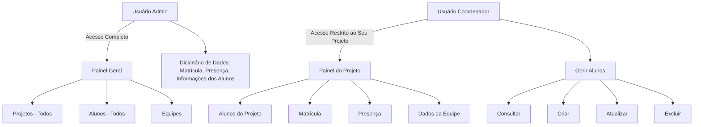

```mermaid
flowchart TD
    A[Usuário Admin] -->|Acesso Completo| P[Painel Geral]
    P --> PA[Projetos - Todos]
    P --> AL[Alunos - Todos]
    P --> EQ[Equipes]

    A --> D[Dicionário de Dados: Matrícula, Presença, Informações dos Alunos]

    C[Usuário Coordenador] -->|Acesso Restrito ao Seu Projeto| PC[Painel do Projeto]
    PC --> PCA[Alunos do Projeto]
    PC --> PCM[Matrícula]
    PC --> PCP[Presença]
    PC --> PCE[Dados da Equipe]

    C --> CRUD[Gerir Alunos]
    CRUD --> CA[Consultar]
    CRUD --> CR[Criar]
    CRUD --> AT[Atualizar]
    CRUD --> EX[Excluir]
```
